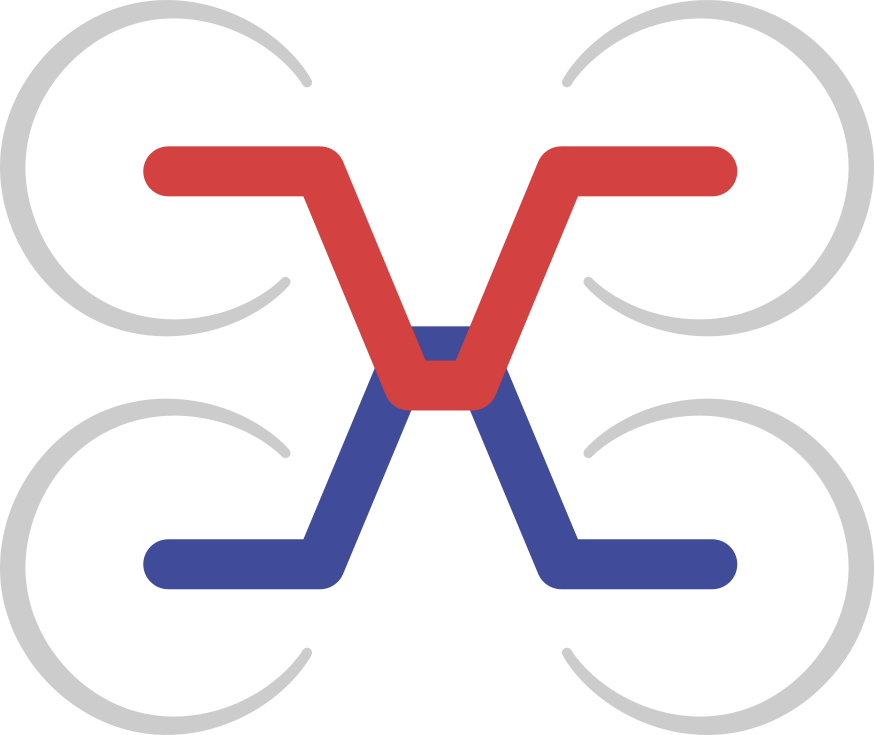
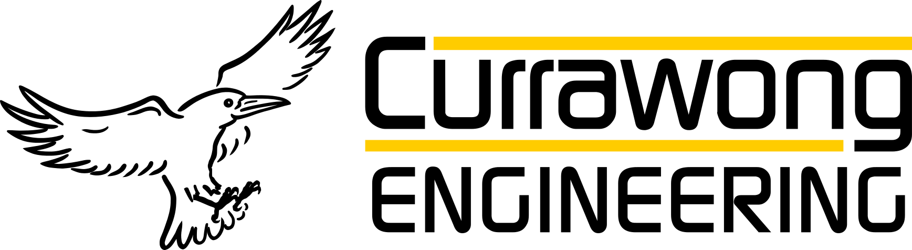

# DroneCAN

DroneCAN is the primary CAN protocol used by the ArduPilot and PX4 projects for communication with CAN peripherals. It is an open protocol with open communication, specification and multiple open implementations.

## Relationship with UAVCAN

DroneCAN was created to continue the development of the widely used
[UAVCAN](https://uavcan.org/) v0.9 protocol. This protocol has proven
itself as robust and feature rich and has been widely deployed in the
commercial drone industry and enjoys broad support among industry
partners. The proposed introduction of the UAVCAN v1 protocol involved
changes to UAVCAN that increased complexity and did not offer a smooth migration path for existing deployments. After extended discussions within the UAVCAN consortium it was decided that the best solution was to continue development of UAVCAN v0.9 under the name DroneCAN.

## Key Features

The first version of DroneCAN, known as DroneCAN v1, is identical to the existing UAVCAN v0.9 protocol. This means that the large number of existing UAVCAN v0.9 devices used throughout the drone industry are already DroneCAN v1 compliant. Features inherited from UAVCAN v0.9 include:
 - detailed protocol specification
 - DSDL message description language for message description
 - DNA (dynamic node allocation) for assignment of CAN node IDs
 - multiple open DSDL compilers that produce C and C++ bindings
 - rich python implementation
 - feature rich graphical user interface for diagnostics and device configuration
 - mature implementations in ArduPilot and PX4 autopilots
 - [AP_Periph](https://ardupilot.org/dev/docs/ap-peripheral-landing-page.html) and [PX4 cannode](https://docs.px4.io/master/en/uavcan/) toolkits for easy creation of feature rich peripherals

## Continued Evolution

DroneCAN is a continually evolving protocol. Starting with DroneCAN v1 the protocol will evolve to add new features to assist in the widespread adoption of CAN throughout the UAV industry. The DroneCAN project is committed to ensuring this evolution is done in a manner which retains compatibility with existing DroneCAN devices.
Key features planned for DroneCAN in the near future:
 - support for FDCAN, allowing for higher data rates and larger frame sizes
 - a node capability message to allow the DNA server to determine both the hardware and software capabilities of connected nodes, to facilitate smooth transitions to updated protocol versions
 - support for extending messages definitions while retaining compatibility with existing implementations
 - a comprehensive re-work of existing DSDL message structures to improve efficiency and flexibility

## Development

The DroneCAN project has an active development community.

 - discussions on discord at [https://dronecan.org/discord](https://dronecan.org/discord)
 - development on github at [https://github.com/DroneCAN](https://github.com/DroneCAN)

## Supporters

<table style="padding:10px">
  <tr>
    <td></td>
    <td></td>
    <td></td>
   </tr>
  <tr>
    <td></td>
    <td></td>
    <td></td>
   </tr>
  <tr>
    <td></td>
    <td></td>
   </tr>
</table>

## Joining DroneCAN

If you would like to publicly support the DroneCAN project then please
fill in the [application form](https://dronecan.org/apply)
